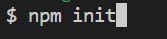
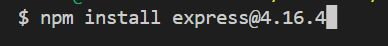
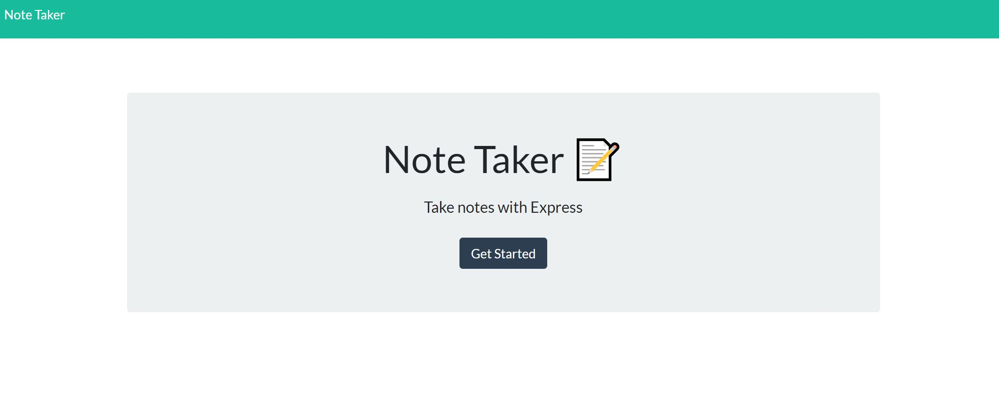
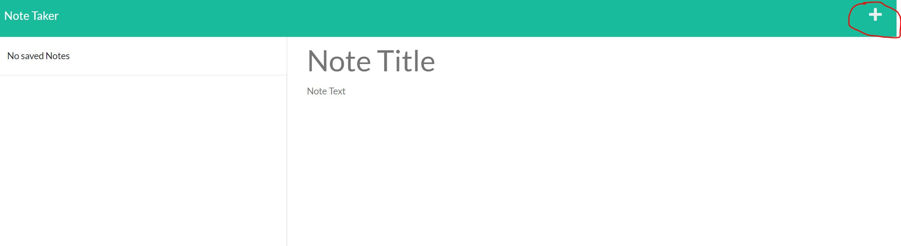
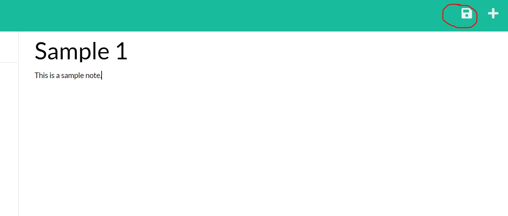
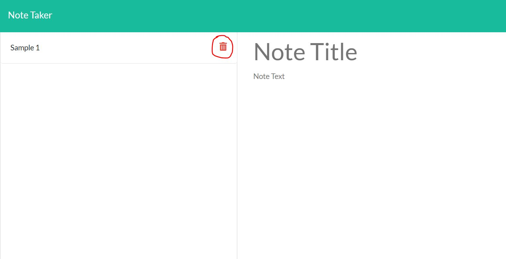

# Simple Note Taker

## Description

- This is a note-taking application for a small company to keep track of things.
- Users can see all previously saved notes, click to see a specific note, add a note, and to delete a note.
- All notes are saved in a db.json file.
- A note consists of a title and a body message.

## Table of content

- [Installation](#installation)
- [Usage](#usage)
- [Credits](#credits)
- [License](#license)

## Installation

- If you do not have a package.json file yet in your working directory, create one by doing:

  - 

- Install express.js:
  - 

## Usage

- Link to Heroku hosting: [https://immense-lowlands-89088.herokuapp.com/](https://immense-lowlands-89088.herokuapp.com/

- Link to the Github Repository: [https://github.com/BranBao1995/Simple-Note-Taker](https://github.com/BranBao1995/Simple-Note-Taker)

- This is the home page, click "get started" to go to the notes page:

- This is the notes page without any notes yet, click the "+" button on the upper right of the page to add a note:

- After typing in the title and the body message, click the "save" icon on the upper right of the page to save this note:

- After saving your first note, you should be able to see the saved note appear on the left side of the page. You can click the "delete" icon to delete this note anytime:

- Just like that, your notes page is now empty again:

## Credits

- Author's Github Profile: [https://github.com/BranBao1995]https://github.com/BranBao1995)

## License 

The MIT License

Copyright (c) [2022] [Hongdong Bao]

Permission is hereby granted, free of charge, to any person obtaining a copy
of this software and associated documentation files (the "Software"), to deal
in the Software without restriction, including without limitation the rights
to use, copy, modify, merge, publish, distribute, sublicense, and/or sell
copies of the Software, and to permit persons to whom the Software is
furnished to do so, subject to the following conditions:

The above copyright notice and this permission notice shall be included in all
copies or substantial portions of the Software.

THE SOFTWARE IS PROVIDED "AS IS", WITHOUT WARRANTY OF ANY KIND, EXPRESS OR
IMPLIED, INCLUDING BUT NOT LIMITED TO THE WARRANTIES OF MERCHANTABILITY,
FITNESS FOR A PARTICULAR PURPOSE AND NONINFRINGEMENT. IN NO EVENT SHALL THE
AUTHORS OR COPYRIGHT HOLDERS BE LIABLE FOR ANY CLAIM, DAMAGES OR OTHER
LIABILITY, WHETHER IN AN ACTION OF CONTRACT, TORT OR OTHERWISE, ARISING FROM,
OUT OF OR IN CONNECTION WITH THE SOFTWARE OR THE USE OR OTHER DEALINGS IN THE
SOFTWARE.
